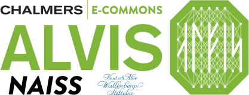

# Batch Connect - Alvis OnDemand VNC

## History 

In the past We served VNC sessions login nodes and use this app to connect
 to them at [Alvis OnDemand](https://portal.c3se.chalmers.se). 
Now we have switched to the better option of runnig RDP on the nodes. 
The app is now just a placeholder that links to the new services 
(while more smooth authentication mechanism might be worked on
in the future).

If you are here for the VNC-on-login-node app based on 
[Linux host adapter](https://discourse.openondemand.org/t/linux-host-adapter-connect-to-localhost/2536),
 check out the `legacy` branch. 
The work with the VNC app are contributed mostly by Arvid and Linus from UPPMAX.
